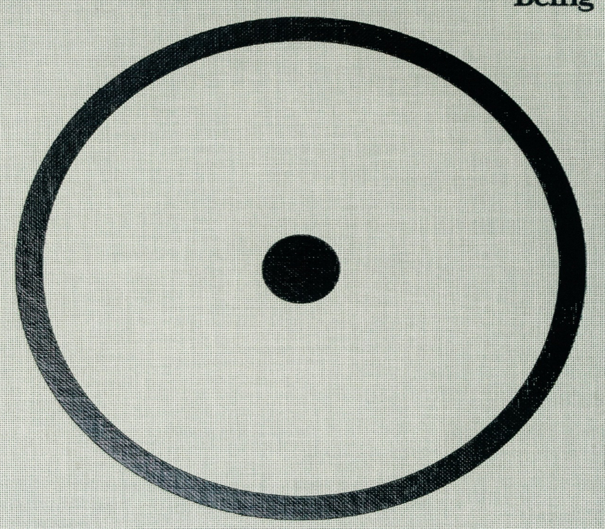

  

# The Creative Act  

A Way of Being  

Rick Rubin  

PENGUIN PRESS   
An imprint of Penguin Random House LLC   
penguinrandomhouse.com Copyright $\copyright$ 2023 by Rick Rubin   
Penguin Random House supports copyright. Copyright fuels creativity, encourages diverse voices, promotes free speech, and creates a vibrant culture. Thank you for buying an authorized edition of this book and for complying with copyright laws by not reproducing, scanning, or distributing any part of it in any form without permission. You are supporting writers and allowing Penguin Random House to continue to publish books for every reader. TURN! TURN! TURN!   
(To Everything There Is A Season)   
Words from the Book of Ecclesiastes   
Adaptation and Music by Pete Seeger   
TRO- $\cdot{\copyright}$ Copyright 1962 (Renewed) Melody Trails, Inc., New York, NY International Copyright Secured. Made in U.S.A.   
All Rights Reserved. Used by Permission.  

Excerpt from “John Wooden: First, How to Put On Your Socks” as told to Devin Gordon, Newsweek (October 24, 1999). Used by permission.  

Library of Congress Cataloging-in-Publication Data  

Names: Rubin, Rick, author. | Strauss, Neil, author.   
Title: The creative act : a way of being / Rick Rubin, with Neil Strauss.   
Description: New York : Penguin Press, 2023.   
Identifiers: LCCN 2022035005 | ISBN 9780593652886 (hardcover) | ISBN 9780593653425 (ebook) Subjects: LCSH: Creative ability. | Creation (Literary, artistic, etc.)   
Classification: LCC BF408 .R7368 2023 | DDC 153.3/5—dc23/eng/20220921   
LC record available at https://lccn.loc.gov/2022035005  

Book design by Rick Rubin with special thanks to Pentagram, adapted for ebook by Cora Wigen  

The object isn’t to make art, it’s to be in that wonderful state which makes art inevitable.  

Robert Henri  

Everyone Is a Creator   
Tuning In   
The Source of Creativity   
Awareness   
The Vessel and the Filter   
The Unseen   
Look for Clues   
Practice   
Submerge (The Great Works)   
Nature as Teacher   
Nothing Is Static   
Look Inward   
Memories and the Subconscious   
It’s Always There   
Setting   
Self-Doubt   
Make It Up   
Distraction   
Collaboration   
Intention   
Rules   
The Opposite Is True   
Listening   
Patience   
Beginner’s Mind   
Inspiration   
Habits   
Seeds   
Experimentation   
Try Everything   
Crafting   
Momentum   
Point of View   
Breaking the Sameness   
Completion   
The Abundant Mindset   
The Experimenter and the Finisher   
Temporary Rules   
Greatness   
Success   
Connected Detachment (Possibility)   
The Ecstatic   
Point of Reference   
Non-Competition   
Essence   
Apocrypha   
Tuning Out (Undermining Voices)   
Self-Awareness   
Right Before Our Eyes   
A Whisper Out of Time   
Expect a Surprise   
Great Expectations   
Openness   
Surrounding the Lightning Bolt   
24/7 (Staying In It)   
Spontaneity (Special Moments)   
How to Choose   
Shades and Degrees   
Implications (Purpose)   
Freedom   
The Possessed   
What Works for You (Believing)   
Adaptation   
Translation   
Clean Slate   
Context   
The Energy (In the Work)   
Ending to Start Anew (Regeneration)   
Play   
The Art Habit (Sangha)   
The Prism of Self   
Let It Be   
Cooperation   
The Sincerity Dilemma   
The Gatekeeper   
Why Make Art?   
Harmony   
What We Tell Ourselves Nothing in this book   
is known to be true.   
It’s a reflection on what I’ve noticed— Not facts so much as thoughts. Some ideas may resonate,   
others may not.   
A few may awaken an inner knowing you forgot you had.   
Use what’s helpful.   
Let go of the rest.  

Each of these moments is an invitation to further inquiry: looking deeper, zooming out, or in. Opening possibilities for a new way of being.  

# Everyone Is a Creator  

Those who do not engage in the traditional arts might be wary of calling themselves artists. They might perceive creativity as something extraordinary or beyond their capabilities. A calling for the special few who are born with these gifts.  

Fortunately, this is not the case.  

Creativity is not a rare ability. It is not difficult to access. Creativity is a fundamental aspect of being human. It’s our birthright. And it’s for all of us.  

Creativity doesn’t exclusively relate to making art. We all engage in this act on a daily basis.  

To create is to bring something into existence that wasn’t there before. It could be a conversation, the solution to a problem, a note to a friend, the rearrangement of furniture in a room, a new route home to avoid a traffic jam.  

What you make doesn’t have to be witnessed, recorded, sold, or encased in glass for it to be a work of art. Through the ordinary state of being, we’re already creators in the most profound way, creating our experience of reality and composing the world we perceive.  

In each moment, we are immersed in a field of undifferentiated matter from which our senses gather bits of information. The outside universe we perceive doesn’t exist as such. Through a series of electrical and chemical reactions, we generate a reality internally. We create forests and oceans, warmth and cold. We read words, hear voices, and form interpretations. Then, in an instant, we produce a response. All of this in a world of our own creation.  

Regardless of whether or not we’re formally making art, we are all living as artists. We perceive, filter, and collect data, then curate an experience for ourselves and others based on this information set. Whether we do this consciously or unconsciously, by the mere fact of being alive, we are active participants in the ongoing process of creation.  

To live as an artist is a way of being in the world. A way of perceiving. A practice of paying attention. Refining our sensitivity to tune in to the more subtle notes. Looking for what draws us in and what pushes us away. Noticing what feeling tones arise and where they lead.  

Attuned choice by attuned choice, your entire life is a form of selfexpression. You exist as a creative being in a creative universe. A singular work of art.  

# Tuning In  

Think of the universe as an eternal creative unfolding.  

Trees blossom.   
Cells replicate.   
Rivers forge new tributaries.  

The world pulses with productive energy, and everything that exists on this planet is driven by that energy.  

Every manifestation of this unfolding is doing its own work on behalf of the universe, each in its own way, true to its own creative impulse.  

Just as trees grow flowers and fruits, humanity creates works of art. The Golden Gate Bridge, the White Album, Guernica, Hagia Sophia, the Sphinx, the space shuttle, the Autobahn, “Clair de lune,” the Colosseum in Rome, the Phillips screwdriver, the iPad, Philadelphia cheesesteak.  

Look around you: there are so many remarkable accomplishments to appreciate. Each of these is humanity being true to itself, as a hummingbird is true to itself by building a nest, a peach tree by bearing fruit, and a nimbus cloud by producing rain.  

Every nest, every peach, every raindrop, and every great work is different. Some trees may appear to make more beautiful fruits than others, and some humans may appear to compose greater works than others. The taste and beauty are in the eye of the beholder.  

How does the cloud know when to rain? How does the tree know when spring begins? How does the bird know when it’s time to build a new nest?  

The universe functions like a clock:  

To everything—   
There is a season—   
And a time to every purpose under heaven   
A time to be born, a time to die   
A time to plant, a time to reap   
A time to kill, a time to heal   
A time to laugh, a time to weep   
A time to build up, a time to break down   
A time to dance, a time to mourn   
A time to cast away stones   
A time to gather stones together  

These rhythms are not set by us. We are all participating in a larger creative act we are not conducting. We are being conducted. The artist is on a cosmic timetable, just like all of nature.  

If you have an idea you’re excited about and you don’t bring it to life, it’s not uncommon for the idea to find its voice through another maker. This isn’t because the other artist stole your idea, but because the idea’s time has come.  

In this great unfolding, ideas and thoughts, themes and songs and other works of art exist in the aether and ripen on schedule, ready to find expression in the physical world.  

As artists, it is our job to draw down this information, transmute it, and share it. We are all translators for messages the universe is broadcasting. The best artists tend to be the ones with the most sensitive antennae to draw in the energy resonating at a particular moment. Many great artists first develop sensitive antennae not to create art but to protect themselves. They have to protect themselves because everything hurts more. They feel everything more deeply.  

Often art arrives in movements. Bauhaus architecture, abstract expressionism, French New Wave cinema, Beat poetry, punk rock to name a few from recent history. These movements appear like a wave; some artists are able to read the culture and position themselves to ride that swell. Others might see the wave and choose to swim against the current.  

We are all antennae for creative thought. Some transmissions come on strong, others are more faint. If your antenna isn’t sensitively tuned, you’re likely to lose the data in the noise. Particularly since the signals coming through are often more subtle than the content we collect through sensory awareness. They are energetic more than tactile, intuitively perceived more than consciously recorded.  

Most of the time, we are gathering data from the world through the five senses. With the information that’s being transmitted on higher frequencies, we are channeling energetic material that can’t be physically grasped. It defies logic, in the same way that an electron can be in two places at once. This elusive energy is of great worth, though so few people are open enough to hold it.  

How do we pick up on a signal that can neither be heard nor be defined? The answer is not to look for it. Nor do we attempt to predict or analyze our way into it. Instead, we create an open space that allows it. A space so free of the normal overpacked condition of our minds that it functions as a vacuum. Drawing down the ideas that the universe is making available.  

This freedom is not as difficult to achieve as one might think. We all start with it. As children, we experience much less interference between receiving ideas and internalizing them. We accept new information with delight instead of making comparisons to what we already believe; we live in the moment rather than worrying about future consequences; we are spontaneous more than  analytical;  we  are  curious,  not  jaded.  Even  the  most  ordinary experiences in life are met with a sense of awe. Deep sadness and intense excitement can come within moments of each other. There’s no facade and no attachment to a story.  

Artists who are able to continually create great works throughout their lives often manage to preserve these childlike qualities. Practicing a way of being that allows you to see the world through uncorrupted, innocent eyes can free you to act in concert with the universe’s timetable.  

There’s a time for certain ideas to arrive, and they find a way to express themselves through us.  

# The Source of Creativity  

We begin with everything:   
everything seen,   
everything done,   
everything thought,   
everything felt,   
everything imagined,   
everything forgotten,   
and everything that rests unspoken and unthought within us.  

This is our source material, and from it, we build each creative moment.  

This content does not come from inside us. The Source is out there. A wisdom surrounding us, an inexhaustible offering that is always available.  

We either sense it, remember it, or tune in to it. Not only through our experiences. It may also be dreams, intuitions, subliminal fragments, or other ways still unknown by which the outside finds its way inside.  

To the mind, this material appears to come from within. But that’s an illusion. There are tiny fragments of the vastness of Source stored within us. These precious wisps arise from the unconscious like vapor, and condense to form a thought. An idea.  

It may be helpful to think of Source as a cloud.  

Clouds never truly disappear. They change form. They turn into rain and become part of the ocean, and then evaporate and return to being clouds.  

The same is true of art.  

Art is a circulation of energetic ideas. What makes them appear new is that they’re combining differently each time they come back. No two clouds are the same.  

This is why, when we are struck by a new piece of art, it can resonate on a deeper level. Perhaps this is the familiar, coming back to us in an unfamiliar form. Or maybe it is something unknown that we didn’t realize we were looking for. A missing piece in a puzzle that has no end.  

Turning something from an idea into a reality can make it seem smaller. It changes from unearthly to earthly. The imagination has no limits. The physical world does. The work exists in both.  

# Awareness  

In most of our daily activities we choose the agenda and develop a strategy to achieve the goal at hand. We create the program.  

Awareness moves differently. The program is happening around us. The world is the doer and we are the witness. We have little or no control over the content.  

The gift of awareness allows us to notice what’s going on around and inside ourselves in the present moment. And to do so without attachment or involvement. We may observe bodily sensations, passing thoughts and feelings, sounds or visual cues, smells and tastes.  

Through detached noticing, awareness allows an observed flower to reveal more of itself without our intervention. This is true of all things.  

Awareness is not a state you force. There is little effort involved, though persistence is key. It’s something you actively allow to happen. It is a presence with, and acceptance of, what is happening in the eternal now.  

As soon as you label an aspect of Source, you’re no longer noticing, you’re studying. This holds true of any thought that takes you out of presence with the object of your awareness, whether analysis or simply becoming aware that you’re aware. Analysis is a secondary function. The awareness happens first as a pure connection with the object of your attention. If something strikes me as interesting or beautiful, first I live that experience. Only afterward might I attempt to understand it.  

Though we can’t change what it is that we are noticing, we can change our ability to notice.  

We can expand our awareness and narrow it, experience it with our eyes open or closed. We can quiet our inside so we can perceive more on the outside, or quiet the outside so we can notice more of what’s happening inside.  

We can zoom in on something so closely it loses the features that make it what it appears to be, or zoom so far out it seems like something entirely new.  

The universe is only as large as our perception of it. When we cultivate our awareness, we are expanding the universe.  

This expands the scope, not just of the material at our disposal to create from, but of the life we get to live.  

The ability to look deeply   
is the root of creativity.   
To see past the ordinary and mundane   
and get to what might otherwise be invisible.  

# The Vessel and the Filter  

Each of us has a container within. It is constantly being filled with data.  

It holds the sum total of our thoughts, feelings, dreams, and experiences in the world. Let’s call this the vessel.  

Information does not enter the vessel directly, like rain filling into a barrel. It is filtered in a unique way for each of us.  

Not everything makes it through this filter. And what does get through doesn’t always do so faithfully.  

We each have our own method of reducing Source. Our memory space is limited. Our senses often misperceive data. And our minds don’t have the processing power to take in all the information surrounding us. Our senses would be overwhelmed by light, color, sound, and smell. We would not be able to distinguish one object from another.  

To navigate our way through this immense world of data, we learn early in life to focus on information that appears essential or of particular interest. And to tune out the rest.  

As artists, we seek to restore our childlike perception: a more innocent state of wonder and appreciation not tethered to utility or survival.  

Our filter inevitably reduces Source intelligence by interpreting the data that arrives instead of letting it pass freely. As the vessel fills with these recast fragments, relationships are created with the material already collected.  

These relationships produce beliefs and stories. They may be about who we are, the people around us, and the nature of the world we live in. Eventually, these stories coalesce into a worldview.  

As artists, we want to hold these stories softly and find space for the vast amount of information that doesn’t fit easily within the limits of our belief system. The more raw data we can take in, and the less we shape it, the closer we get to nature.  

One can think of the creative act as taking the sum of our vessel’s contents as potential material, selecting for elements that seem useful or significant in the moment, and re-presenting them.  

This is Source drawn through us and made into books, movies, buildings, paintings, meals, businesses—whatever projects we embark on.  

If we choose to share what we make, our work can recirculate and become source material for others.  

Source makes available.   
The filter distills.   
The vessel receives.   
And often this happens beyond our control.  

It is helpful to know this default system can be bypassed. With training, we can improve our interface with Source and radically expand the vessel’s ability to receive. Changing the instrument is not always the easiest way to change the sound of the music, but it can be the most powerful.  

No matter what tools you use to create, the true instrument is you.   
And through you,   
the universe that surrounds us   
all comes into focus.  

# The Unseen  

By conventional definition, the purpose of art is to create physical and digital artifacts. To fill shelves with pottery, books, and records.  

Though artists generally aren’t aware of it, that end work is a by-product of a greater desire. We aren’t creating to produce or sell material products. The act of creation is an attempt to enter a mysterious realm. A longing to transcend. What we create allows us to share glimpses of an inner landscape, one that is beyond our understanding. Art is our portal to the unseen world.  

Without  the  spiritual  component,  the  artist  works  with  a  crucial disadvantage. The spiritual world provides a sense of wonder and a degree of open-mindedness not always found within the confines of science. The world of reason can be narrow and filled with dead ends, while a spiritual viewpoint is limitless and invites fantastic possibilities. The unseen world is boundless.  

The word spirituality may not speak to those who dwell chiefly in the intellect or those who equate the word with organized religion. If you prefer to think of spirituality as simply believing in connection, that’s fine. If you choose to think of it as believing in magic, that’s fine too. The things we believe carry a charge regardless of whether they can be proven or not.  

The practice of spirituality is a way of looking at a world where you’re not alone. There are deeper meanings behind the surface. The energy around you can be harnessed to elevate your work. You are part of something much larger than can be explained—a world of immense possibilities.  

Harnessing this energy can be marvelously useful in your creative pursuits. The principle operates on faith. Believing and behaving as if it’s true. No proof is needed.  

When you’re working on a project, you may notice apparent coincidences appearing more often than randomness allows—almost as if there is another hand guiding yours in a certain direction. As if there is an inner knowing gently informing your movements. Faith allows you to trust the direction without needing to understand it.  

Pay particular attention to the moments that take your breath away—a beautiful sunset, an unusual eye color, a moving piece of music, the elegant design of a complex machine.  

If a piece of work, a fragment of consciousness, or an element of nature is somehow allowing us to access something bigger, that is its spiritual component made manifest. It awards us a glimpse of the unseen.  

It’s not unusual for science to catch up to art, eventually. Nor is it unusual for art to catch up to the spiritual.  

# Look for Clues  

Material  for  our  work  surrounds  us  at  every  turn.  It’s  woven  into conversation, nature, chance encounters, and existing works of art.  

When looking for a solution to a creative problem, pay close attention to what’s happening around you. Look for clues pointing to new methods or ways to further develop current ideas.  

A writer may be in a coffee shop, working on a scene and unsure what a character is going to say next. A phrase might be overheard in the chatter from another table that provides a direct answer, or at least a glimpse of a possible direction.  

We receive these types of messages all the time, if we remain open to them. We might read a book and find a quote leaping off the page, or watch a movie and notice a line that moves us to pause and rewind. Sometimes it’s the exact answer we’ve been looking for. Or it could be an echo of an idea that keeps repeating in other places—begging for more attention or affirming the path we’re on.  

These transmissions are subtle: they are ever-present, but they’re easy to miss. If we aren’t looking for clues, they’ll pass by without us ever knowing. Notice connections and consider where they lead.  

When something out of the ordinary happens, ask yourself why. What’s the message? What could be the greater meaning?  

This process isn’t a science. We can’t control clues, or will them to be revealed. Sometimes it helps to have a strong intention to find a specific answer, or to confirm a particular path. Other times, letting go of that intention altogether can help you find your way.  

An integral part of the artist’s work is deciphering these signals. The more open you are, the more clues you will find and the less effort you’ll need to exert. You may be able to think less and begin to rely on answers arising within you.  

You might imagine that the outside world is a conveyor belt with a stream of small packages on it, always going by. The first step is to notice the conveyor belt is there. And then, any time you want, you can pick up one of those packages, unwrap it, and see what’s inside.  

A helpful exercise might be opening a book to a random page and reading the first line your eyes find. See how what’s written there somehow applies to your situation. Any relevance it bears might be by chance, but you might allow for the possibility that chance is not all that’s at play. When my appendix burst, the doctor who diagnosed it insisted that I go to the hospital immediately to have it removed. I was told there were no other options. I found myself in a nearby bookstore. Standing out on a table in the front was a new book by Dr. Andrew Weil. I picked it up and let it fall open. The first passage my eyes went to said: if a doctor wants to remove a part of your body, and they tell you it has no function, don’t believe this. The information I needed was made available to me in that moment. And I still have my appendix.  

When clues present themselves, it can sometimes feel like the delicate mechanism of a clock at work. As if the universe is nudging you with little reminders that it’s on your side and wants to provide everything you need to complete your mission.  

Look for what you notice but no one else sees.  